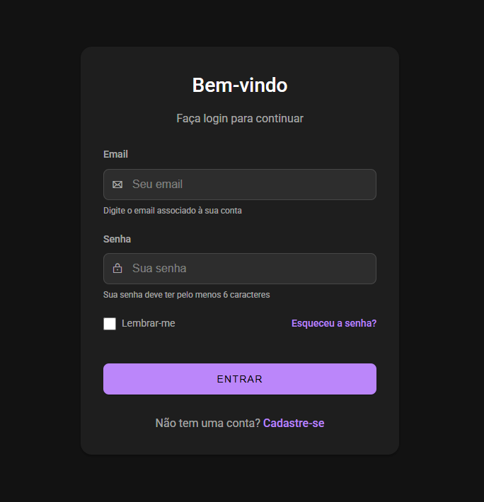

# Tela de Login Material Design (Tema Escuro)


Um componente de tela de login minimalista e elegante, desenvolvido com HTML semântico e CSS, seguindo os princípios do Material Design do Google em tema escuro. Este projeto prioriza acessibilidade, SEO e experiência do usuário.



## ✨ Características

- **Design Minimalista**: Interface limpa e focada na experiência do usuário
- **Tema Escuro**: Reduz a fadiga visual e proporciona uma experiência moderna
- **Material Design**: Segue as diretrizes de design do Google
- **Responsivo**: Adaptável a diferentes tamanhos de tela
- **Acessível**: Implementa práticas de acessibilidade para todos os usuários
- **Otimizado para SEO**: Utiliza HTML semântico e metadados apropriados
- **Phosphor Icons**: Integração com a biblioteca de ícones Phosphor

## 🛠️ Tecnologias Utilizadas

- **HTML5**: Estrutura semântica
- **CSS3**: Estilização moderna com variáveis CSS
- **Phosphor Icons**: Biblioteca de ícones
- **Google Fonts**: Fonte Roboto (padrão do Material Design)

## 📁 Estrutura do Projeto

```
tela-login-material-design/
│
├── index.html          # Arquivo HTML principal
├── style.css           # Arquivo CSS principal
└── README.md           # Documentação do projeto
```

O CSS está incorporado diretamente no arquivo HTML para facilitar a implementação, mas pode ser extraído para um arquivo separado conforme necessário.

## 🚀 Como Usar

### Instalação

1. Clone este repositório ou baixe os arquivos
2. Abra o arquivo `index.html` em seu navegador

### Implementação em Projeto Existente

Para integrar esta tela de login em um projeto existente:

1. Copie o conteúdo HTML da seção `<main>` para seu projeto
2. Copie as regras CSS para seu arquivo de estilos
3. Certifique-se de incluir as dependências:
   - Fonte Roboto do Google Fonts
   - Biblioteca Phosphor Icons

### Personalização Básica

Para alterar as cores principais:

```css
:root {
    --primary-color: #seu-codigo-de-cor; /* Cor principal para botões e links */
    --background: #seu-codigo-de-cor;    /* Cor de fundo da página */
    --surface: #seu-codigo-de-cor;       /* Cor de fundo do card */
}
```

## ♿ Acessibilidade

Este projeto implementa várias práticas de acessibilidade:

- **HTML Semântico**: Uso apropriado de elementos como `<main>`, `<section>`, `<h1>`, etc.
- **ARIA**: Atributos como `aria-labelledby` e `aria-describedby` para melhorar a navegação por leitores de tela
- **Textos Alternativos**: Classe `sr-only` para textos acessíveis apenas para leitores de tela
- **Contraste**: Cores com contraste adequado para melhor legibilidade
- **Foco Visível**: Indicadores visuais claros para navegação por teclado
- **Labels**: Todos os campos de formulário possuem labels associados corretamente


## 🔍 SEO

Otimizações para mecanismos de busca incluem:

- **Meta Tags**: Description, keywords e author para melhor indexação
- **HTML Semântico**: Estrutura clara que ajuda os motores de busca a entenderem o conteúdo
- **Título Descritivo**: Tag `<title>` informativa
- **Responsividade**: Design adaptável a diferentes dispositivos (fator de ranqueamento)


## 🎨 Personalização

### Cores

O tema utiliza variáveis CSS para facilitar a personalização. As principais variáveis são:

```css
:root {
    --primary-color: #bb86fc;       /* Cor principal (botões, links) */
    --primary-variant: #3700b3;     /* Variação da cor principal */
    --secondary-color: #03dac6;     /* Cor secundária */
    --background: #121212;          /* Cor de fundo da página */
    --surface: #1e1e1e;             /* Cor de fundo do card */
    --surface-variant: #2d2d2d;     /* Cor de fundo dos inputs */
    --error-color: #cf6679;         /* Cor para mensagens de erro */
    --on-primary: #000000;          /* Cor do texto sobre elementos primários */
    --on-secondary: #000000;        /* Cor do texto sobre elementos secundários */
    --on-background: #ffffff;       /* Cor do texto sobre o fundo */
    --on-surface: #ffffff;          /* Cor do texto sobre a superfície */
    --on-surface-medium: rgba(255, 255, 255, 0.6); /* Texto médio */
    --on-surface-disabled: rgba(255, 255, 255, 0.38); /* Texto desabilitado */
}
```

### Tipografia

Para alterar a fonte:

1. Substitua a importação do Google Fonts
2. Atualize a propriedade `font-family` no seletor `body`


### Ícones

Os ícones são da biblioteca Phosphor Icons. Para alterá-los:

1. Mantenha o script de importação da biblioteca
2. Substitua as classes dos ícones (ex: `ph ph-envelope` para outro ícone)


## 📝 Boas Práticas

Este projeto implementa várias boas práticas de desenvolvimento web:

- **Código Limpo**: HTML e CSS bem organizados e comentados
- **Variáveis CSS**: Uso de variáveis para facilitar manutenção
- **Mobile First**: Design responsivo priorizando dispositivos móveis
- **Acessibilidade**: Implementação de práticas WCAG
- **Semântica**: Uso apropriado de elementos HTML5
- **Validação de Formulário**: Atributos HTML5 para validação básica
- **Desempenho**: CSS otimizado e mínimo de dependências externas
